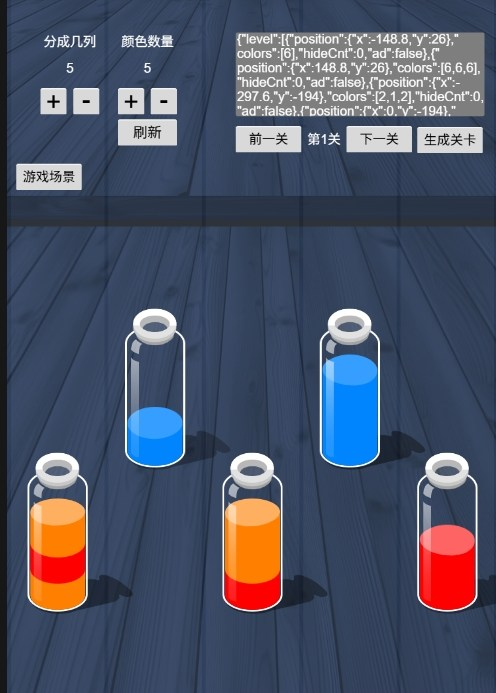

# Water Sort Game Editor (Cocos Creator 3.8.6)

A water sort puzzle game editor project built with **Cocos Creator 3.8.6**.
This repository contains the source project and can be opened inside Cocos Creator for editing and building.

---

## 🎮 Play Online

👉 **Play water sort puzzle game online:**
https://cocos.app/game/sort-water-now

👉 **More free browser games:**
https://cocos.app

---
Need help solving water sort puzzle levels? This project includes a Cocos Creator level editor and helper workflow for creating, testing, and analyzing water sort puzzle levels.

## 📸 Screenshots




---

## 🧠 About the Game

Water Sort Puzzle is a relaxing and addictive puzzle game where players need to sort colored liquids into separate tubes.

* Tap bottles to pour water
* Only same colors can stack
* Complete when all colors are sorted

---
## 🧩 Water Sort Solver & Level Helper

This project is not only a water sort puzzle game editor, but also a useful helper for testing water sort puzzle levels.

You can use the editor to:

- Create custom bottle layouts
- Generate level data automatically
- Test whether a water sort puzzle level is playable
- Adjust columns, bottle count, and bottle positions
- Copy level data for further analysis

If you are looking for a water sort solver or water sort puzzle solver, this project can help you understand how levels are structured and tested.

## 🛠️ Built With

* Cocos Creator **3.8.6**
* JavaScript / TypeScript
* HTML5 (Web build supported)

---

## 📂 Project Structure

```bash
water-sort-game-editor/
│
├── assets/        # Game assets (scenes, scripts, resources)
├── settings/      # Cocos project settings
│
├── project.json
├── tsconfig.json
├── jsconfig.json
└── creator.d.ts
```

---

## 🚀 How to Run (Cocos Creator)

This project **cannot be run directly in browser**.
You need to open it using Cocos Creator.

### Columns
1. You can generate between 1 and 8 columns.

### Colors
1. The number of colors is limited based on the number of bottles and layers.

### Previous / Next Level
1. You can switch between previous and next levels in the editor.
2. The current level data will be displayed in the top input box.
3. New levels will include 3 empty bottles by default.

### Generate Level
1. The system will automatically generate level data based on the current bottle count and layers.
2. The generated data will appear in the top input box for copying.

### Column Settings (Count & Position)
1. Buttons '0', '1', '2', '3', '4' represent how many bottles can be placed in the current column.
2. Use '+' and '-' to adjust the vertical position of bottles in the column.
3. You can modify the movement distance in UiEdColumn.ts.
---

## 📌 Keywords

water sort puzzle, water sort solver, water sort puzzle solver, water sort game editor, cocos creator game, html5 game, browser puzzle game, relaxing puzzle game
---

## 📄 License

MIT
