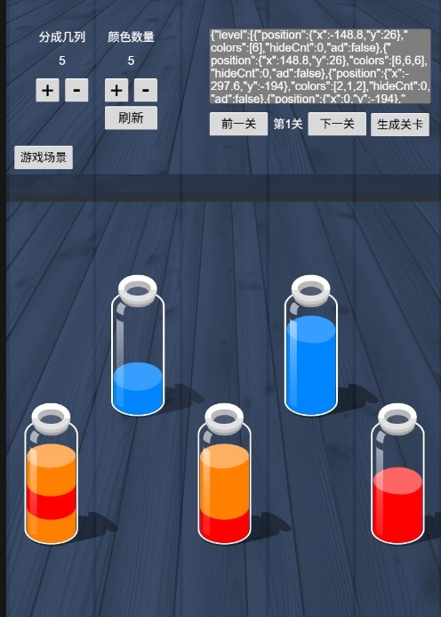

# Water Sort Game Editor

A Cocos Creator project for creating, editing, and testing water sort puzzle levels.

This repository contains the source project for a water sort puzzle game editor. It is designed for building custom bottle layouts, generating level data, and testing water sort puzzle gameplay inside Cocos Creator.

---

## 📸 Screenshots




---

## 🧠 What This Project Does

This project is a level editor and helper tool for water sort puzzle games.

You can use it to:

- Create custom bottle layouts
- Generate water sort level data
- Adjust bottle columns and positions
- Test puzzle layouts during development
- Copy level data for further editing or analysis
- Build and preview the game with Cocos Creator

It is useful for developers who want to study how water sort puzzle levels are structured, tested, and prepared for HTML5 browser games.

---

## 🎮 Play Online

You can try the browser version of the game here:

👉 https://cocos.app/game/sort-water-now

---

## 🧩 Water Sort Solver Workflow

This editor can also be used together with a water sort solver workflow.

The editor helps create and export level data, while the online solver page can be used to test JSON-based puzzle layouts and explore possible solving steps.

Related pages:

- Water Sort JSON Solver: https://cocos.app/tools/sort-solver
- More Sort Puzzle Games: https://cocos.app/collection/sort-games
- Try the Daily Challenge: https://sortinggames.io/daily-water-sort/
---

## 🛠️ Built With

- Cocos Creator 3.8.6
- TypeScript / JavaScript
- HTML5 web build support

---

## 📂 Project Structure

```bash
water-sort-game-editor/
│
├── assets/        # Game assets, scenes, scripts, and resources
├── settings/      # Cocos Creator project settings
│
├── project.json
├── tsconfig.json
├── jsconfig.json
└── creator.d.ts
```

---

## 🚀 How to Open the Project

This project cannot be run directly by opening an HTML file in the browser.

To use it:

1. Install Cocos Creator.
2. Open Cocos Creator.
3. Choose **Open Project**.
4. Select this repository folder.
5. Open the main scene from the `assets` folder.
6. Run the project in the Cocos Creator editor.
7. Build a web version if you want to export it as an HTML5 game.

---

## 🧪 Editor Features

### Column Settings

The editor supports custom bottle column layouts.

- Generate between 1 and 8 columns
- Set how many bottles appear in each column
- Adjust the vertical position of each column
- Modify bottle movement distance in `UiEdColumn.ts`

### Level Generation

The editor can automatically generate level data based on the current bottle count and layer settings.

- Generated level data appears in the top input box
- Level data can be copied for testing or further editing
- New levels include empty bottles by default

### Previous / Next Level

You can switch between previous and next levels inside the editor.

- The current level data is displayed in the top input box
- You can review, copy, and adjust level data while testing

### Colors and Bottles

The number of colors is limited by the bottle count and layer count.

This helps keep generated levels playable and easier to test during development.

---

## 🔗 Related Project Ideas

This project can be used as a starting point for:

- Water sort puzzle level design
- Water sort puzzle solver experiments
- JSON-based puzzle level testing
- HTML5 puzzle game development
- Cocos Creator puzzle game prototypes

---
## Live Demo

A lightweight Replit demo is available here:

https://water-sort-json-solver-demo--oanhere33.replit.app/

This demo previews sample water sort puzzle JSON levels and shows basic solver steps.


## 📌 Keywords

Water sort puzzle, water sort level editor, water sort solver, water sort puzzle solver, Cocos Creator puzzle game, HTML5 puzzle game, browser puzzle game.

---

## 📄 License

MIT